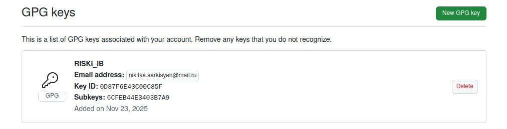
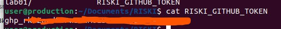
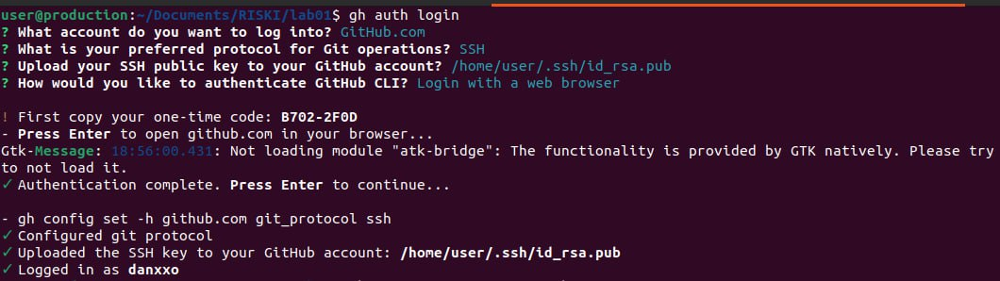
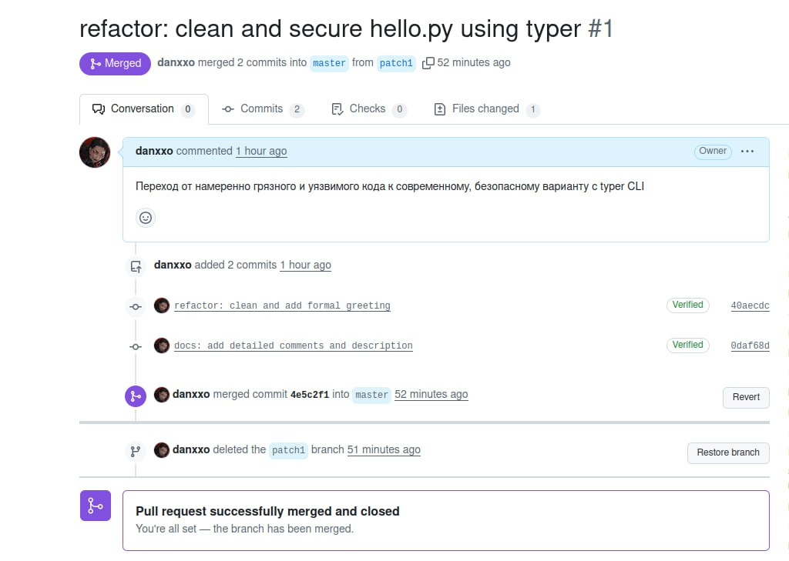
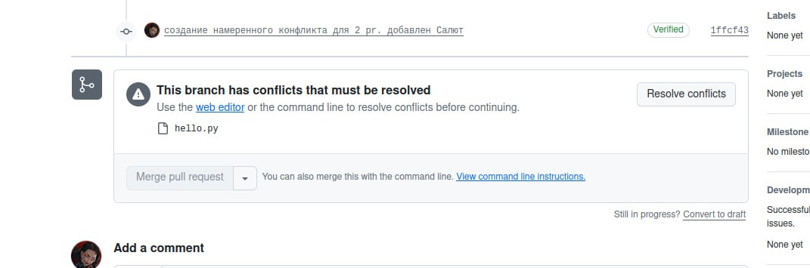
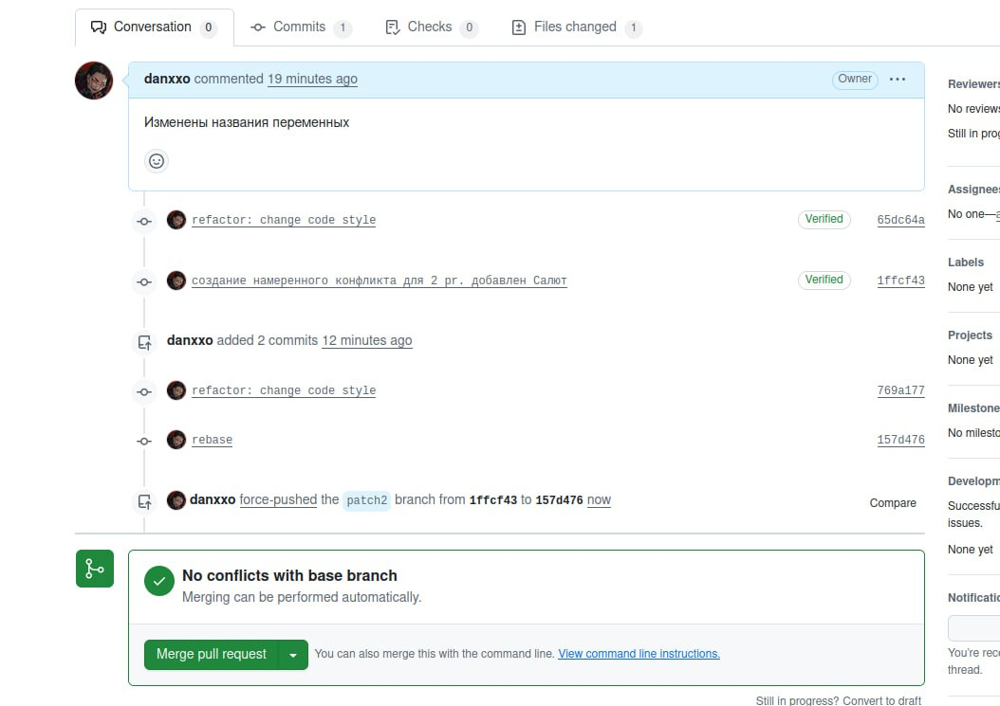
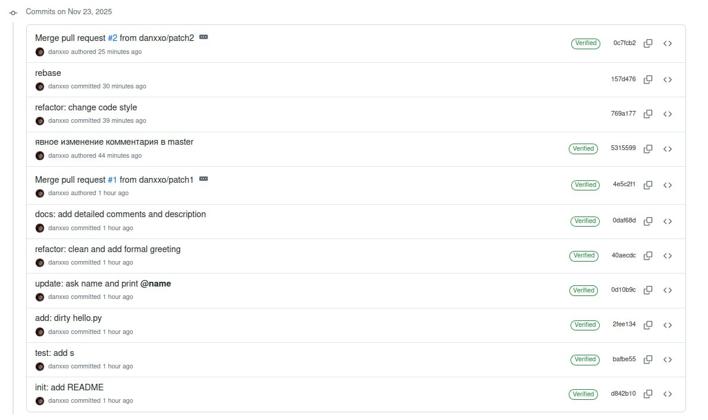

# Риски ЛР1 — Git, Rebase, разрешение конфликтов


### Пре-лаба

**1. Созданный gpg**


**2. Созданный токен**


**3. Успешный gh login**


### Лаба
**PR 1**


**PR 2 Конфликт**


**PR 2 Конфликт в коде**


**PR 2 Конфликт решен**


**Локальная история коммитов**
```
commit 0c7fcb2349e3bdd29adcfee22d1662373b3f8c36 (HEAD -> master, origin/master)
Merge: 5315599 157d476
Author: danxxo <90875721+danxxo@users.noreply.github.com>
Date:   Sun Nov 23 20:21:20 2025 +0300

    Merge pull request #2 from danxxo/patch2
    
    style: code style improvements

commit 157d476baf0d4c848d2e58b30f4b9d280f111e18 (origin/patch2)
Author: Nikita Busarov <nikitka.sarkisyan@mail.ru>
Date:   Sun Nov 23 20:04:31 2025 +0300

    rebase

commit 769a1777b2fe4406b19718099ce4e6fc58701b33
Author: Nikita Busarov <nikitka.sarkisyan@mail.ru>
Date:   Sun Nov 23 19:57:29 2025 +0300

    refactor: change code style

commit 531559908033c0d4450333fb47b3dc7d48a8779c
Author: danxxo <90875721+danxxo@users.noreply.github.com>
Date:   Sun Nov 23 20:02:17 2025 +0300

    явное изменение комментария в master

commit 4e5c2f1bb76654838bcc047832797801f55d44db
Merge: 0d10b9c 0daf68d
Author: danxxo <90875721+danxxo@users.noreply.github.com>
Date:   Sun Nov 23 19:49:46 2025 +0300

    Merge pull request #1 from danxxo/patch1
    
    refactor: clean and secure hello.py using typer

commit 0daf68dedd0ebf758aaa66fd16d2e3b11ca0b7d0 (origin/patch1)
Author: Nikita Busarov <nikitka.sarkisyan@mail.ru>
Date:   Sun Nov 23 19:42:30 2025 +0300

    docs: add detailed comments and description

commit 40aecdc53005aa79bb9ac547f5d6120a6bfde2e6
Author: Nikita Busarov <nikitka.sarkisyan@mail.ru>
Date:   Sun Nov 23 19:33:45 2025 +0300

    refactor: clean and add formal greeting

commit 0d10b9cc12578bb3dabf8d65c5578f1038ec9504
Author: Nikita Busarov <nikitka.sarkisyan@mail.ru>
Date:   Sun Nov 23 19:29:09 2025 +0300

    update: ask name and print @name

commit 2fee134b2bec710a99e27cf980e61009d5d595a8
Author: Nikita Busarov <nikitka.sarkisyan@mail.ru>
Date:   Sun Nov 23 19:19:26 2025 +0300

    add: dirty hello.py

commit bafbe55f647a5761f09267a32898ab1f4201f26b
Author: Nikita Busarov <nikitka.sarkisyan@mail.ru>
Date:   Sun Nov 23 19:01:44 2025 +0300

    test: add s

commit d842b1008435a750e2a75e5fab19f224902754c9
Author: Nikita Busarov <nikitka.sarkisyan@mail.ru>
Date:   Sun Nov 23 18:59:10 2025 +0300

    init: add README
```

**Коммиты в удаленном репозитории**


### Дополнительная информация
#### gnupg

**gnupg** — свободная реализация стандарта OpenPGP (Gnu Privacy Guard). Используется для шифрования, расшифровки и цифровой подписи данных, в том числе для подписания Git-коммитов и тегов с помощью пары ключей RSA/Ed25519.

#### smimesign
**smimesign** — утилита из пакета mono-tools, которая подписывает электронные письма (и .eml-файлы) по стандарту S/MIME с использованием X.509-сертификата и закрытого ключа.