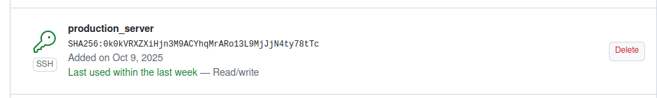

<div align="center">
<h1><a id="intro">Лабораторная работа №1</a><br></h1>
<a href="https://docs.github.com/en"></a>
<a href="https://daringfireball.net/projects/markdown"></a> 
<a href="https://symbl.cc/en/unicode-table"></a> 
<a href="https://shields.io"></a>
<a href="https://img.shields.io/badge/Risk_Analyze-2448a2"></a> </a> </a></div>

## Задание

- [x] 1. Зарегистрироваться на почтовом сервисе **Gmail**. В случае наличия аккаунта - не требуется
- [x] 2. Зарегистрироваться на сервисе совместной разработки **GitHub**. В случае наличия аккаунта требуется произвести дополнительные настройки и обновить данные персонификации
- [x] 3. Отправить зарегистрированный адрес почтового ящика личным сообщением
- [x] 4. Отправить зарегистрированный логин личным сообщением
- [x] 5. Ознакомиться со ссылками учебного материала и формализованными требованиями из основного описания
- [x] 6. Сгенерировать **SSH** ключ и добавить его в список ключей для сервиса **GitHub**

- [x] 7. Сгенерировать **Personal Token** с правами **gist** и сохранить его в файл


- [x] 8. Сгенерировать GnuPG для подтверждения подписания коммитов и возможно использование Х.509 (включить в отчет описание, что такое `smimesign`)


- [x] 9. Подготовить глобальные переменные окружения для **GitHub**
```bash
gpg --list-secret-keys --keyid-format LONG 
git config --global user.signingkey 0D87F6E43C00C85F
```
- [x] 10. Ознакомиться с материалами `gh` сервиса и использовать их для авторизации, `commit`, `pull request` и тд.


```bash
gh repo create <REPO_NAME> --public --source=. --remote=origin
gh pr create --title "..." --body "..." --base master --head patch1
gh pr merge <PR_ID> --merge --delete-branch
```
- [x] 11. Выполнить инструкцию учебного материала
- [x] 12. Оформить `README.md` по аналогии и использовать `shield`, etc.
- [x] 13. Составить `gist` отчет и отправить ссылку личным сообщением

## Tutorial

```
git@github.com:danxxo/course_labs.git
```
   
- В локальном репозитории и сделайте `commit`
- Сделайте публикацию своего `commit` с флагом `-S` в удаленный репозиторий

```
git commit -S -m "comment"
```
- Создайте файл `hello.py` в локальном репозитории. Реализуйте **Hello appsec world** на языке python используя несколько интерпретаторов с "грязным" кодом

```python
#!/usr/bin/env python3
#!/usr/bin/python2.7 -u
#!/usr/bin/python
# -*- coding: cp1251 -*-
def main():
    """
    Говорит "Hello appsec world"
    """
    print("Hello appsec world")

if __name__ == "__main__":
    main()
```

- Сделайте `commit` с флагом `-S`
```bash
git commit -S -m "add: dirty hello.py"
```
- Измените исходный код, что бы скрипт запрашивал имя пользователя и выводил `Hello appsec world from @name`

```python
#!/usr/bin/env python3
#!/usr/bin/python2.7 -u
#!/usr/bin/python
# -*- coding: cp1251 -*-

import typer

def main(
    name: str = typer.Argument(..., help="Твое имя")
):
    """
    Говорит "Hello appsec world from @name"
    """
    print(f"Hello appsec world from @{name}")


if __name__ == "__main__":
    typer.run(main)
```
- Сделайте `commit` с флагом `-S` и сделайте публикацию в удаленный репозиторий. Проверьте вывод истории изменений

```bash
git commit -S -m "update: ask name and print @name"
```
- В локальном репозитории создайте ветку `patch1` и внесите изменения исправлению кода и модернизации до следующего вида, что бы код был рабочим. Сделайте публикацию своего `commit` с флагом `-S` в удаленный репозиторий:

```bash

import typer

def main(
    name: str,
    lastname: str = typer.Option("", help="Фамилия пользователя."),
    formal: bool = typer.Option(False, "--formal", "-f", help="Использовать формальное приветствие."),
):
    """
    Говорит "Привет" пользователю, опционально используя фамилию и формальный стиль.
    """
    if formal:
        print(f"Добрый день, {name} {lastname}!")
    else:
        print(f"Привет, {name}!")

if __name__ == "__main__":
    typer.run(main)

 ```

```bash
git checkout -b patch1
git add -A
git commit -S -m
```

 - Доработайте материалы и также опишите их в отчете: 
    1. Проверьте, что ветка `patch1` в удалённом репозитории
    2. Создайте `pull-request` в виде `patch1 -> master`
```bash
gh pr create \
--base master \
--head patch1 \
--title "refactor: clean and secure hello.py using typer" \
--body "Переход от намеренно грязного и уязвимого кода к современному, безопасному варианту с typer CLI"
```


 3. В ветке `patch1` добавьте в исходный код комментарии и убедитесь, что есть указанные изменения в `pull-request`
 4. В удалённый репозитории выполните слияние `pull-request` для `patch1 -> master` и удалите ветку `patch1`
```bash
gh pr merge patch1 --delete-branch
```
 5. Стяните последние актуальные изменения и просмотрите историю изменений для `master`
 6. Удалите локальную ветку `patch1`
 7. Создайте новую локальную ветку `patch2`.
```bash
git checkout -b patch2
```
 8. Измените *code style* по своему усмотрению
```python
import typer

def main(
    username: str,
    lastname: str = typer.Option("", help="Фамилия пользователя."),
    formalOption: bool = typer.Option(False, "--formal", "-f", help="Использовать формальное приветствие."),
):
    """
    Говорит "Здрасьте" пользователю, опционально используя фамилию и формальный стиль.
    """

    # Использование флага formal
    if formalOption:
        print(f"Добрый день, {username} {lastname}!")
    else:
        print(f"Привет, {username}!")

# Основная функция
if __name__ == "__main__":
    typer.run(main)
```
 9.  Сделайте публикацию своего `commit` с флагом `-S` в удаленный репозиторий и создайте pull-request `patch2 -> master`
```bash
git commit -S -m "refactor: change code style"
...
gh pr create \
--base master \
--head patch2 \
--title "style: code style improvements" \
--body "Изменены названия переменных"
```
 10. В ветке **master** удаленного репозитория явно измените комментарий
 11. Увидите, что в `pull-request` появились расхождения

 12. Локально сделайте **rebase** и исправьте расхождения (это называется **конфликт**)


```bash
git rebase origin/master
...
git rebase --continue
```
 13. Сделайте `commit` и опубликуйте изменения в ветке `patch2`
 14. Убедитесь, что пропали конфликтны. 


 15. Сделайте `merge` для `pull-request` `patch2 -> master`.
 16. Подготовьте отчет `gist`.
 17. Продемонстрируйте в материалах отчета историю коммитов на локальном и удаленном репозитории.

## Дополнительные материалы
**Локальная история коммитов**
```
commit 0c7fcb2349e3bdd29adcfee22d1662373b3f8c36 (HEAD -> master, origin/master)
Merge: 5315599 157d476
Author: danxxo <90875721+danxxo@users.noreply.github.com>
Date:   Sun Nov 23 20:21:20 2025 +0300

    Merge pull request #2 from danxxo/patch2
    
    style: code style improvements

commit 157d476baf0d4c848d2e58b30f4b9d280f111e18 (origin/patch2)
Author: Nikita Busarov <nikitka.sarkisyan@mail.ru>
Date:   Sun Nov 23 20:04:31 2025 +0300

    rebase

commit 769a1777b2fe4406b19718099ce4e6fc58701b33
Author: Nikita Busarov <nikitka.sarkisyan@mail.ru>
Date:   Sun Nov 23 19:57:29 2025 +0300

    refactor: change code style

commit 531559908033c0d4450333fb47b3dc7d48a8779c
Author: danxxo <90875721+danxxo@users.noreply.github.com>
Date:   Sun Nov 23 20:02:17 2025 +0300

    явное изменение комментария в master

commit 4e5c2f1bb76654838bcc047832797801f55d44db
Merge: 0d10b9c 0daf68d
Author: danxxo <90875721+danxxo@users.noreply.github.com>
Date:   Sun Nov 23 19:49:46 2025 +0300

    Merge pull request #1 from danxxo/patch1
    
    refactor: clean and secure hello.py using typer

commit 0daf68dedd0ebf758aaa66fd16d2e3b11ca0b7d0 (origin/patch1)
Author: Nikita Busarov <nikitka.sarkisyan@mail.ru>
Date:   Sun Nov 23 19:42:30 2025 +0300

    docs: add detailed comments and description

commit 40aecdc53005aa79bb9ac547f5d6120a6bfde2e6
Author: Nikita Busarov <nikitka.sarkisyan@mail.ru>
Date:   Sun Nov 23 19:33:45 2025 +0300

    refactor: clean and add formal greeting

commit 0d10b9cc12578bb3dabf8d65c5578f1038ec9504
Author: Nikita Busarov <nikitka.sarkisyan@mail.ru>
Date:   Sun Nov 23 19:29:09 2025 +0300

    update: ask name and print @name

commit 2fee134b2bec710a99e27cf980e61009d5d595a8
Author: Nikita Busarov <nikitka.sarkisyan@mail.ru>
Date:   Sun Nov 23 19:19:26 2025 +0300

    add: dirty hello.py

commit bafbe55f647a5761f09267a32898ab1f4201f26b
Author: Nikita Busarov <nikitka.sarkisyan@mail.ru>
Date:   Sun Nov 23 19:01:44 2025 +0300

    test: add s

commit d842b1008435a750e2a75e5fab19f224902754c9
Author: Nikita Busarov <nikitka.sarkisyan@mail.ru>
Date:   Sun Nov 23 18:59:10 2025 +0300

    init: add README
```

**Коммиты в удаленном репозитории**


## Дополнительные задания
#### gnupg

**gnupg** — свободная реализация стандарта OpenPGP (Gnu Privacy Guard). Используется для шифрования, расшифровки и цифровой подписи данных, в том числе для подписания Git-коммитов и тегов с помощью пары ключей RSA/Ed25519.

#### smimesign
**smimesign** — утилита из пакета mono-tools, которая подписывает электронные письма (и .eml-файлы) по стандарту S/MIME с использованием X.509-сертификата и закрытого ключа.

#### [подпись](https://labs.etsi.org/rep/help/user/project/repository/signed_commits/x509.md) коммитов x509

- **GPG**: На Linux подпись X.509 интегрируется с GPG через инструмент **gpgsm**. Он извлекает ID ключа из сертификата и используется для подписи. Конфиг Git: git config --global gpg.format x509 и user.signingkey из gpgsm. Это позволяет использовать существующую инфраструктуру GPG для X.509, без отдельного софта.
- **smimesign**: На Windows/macOS (где gpgsm неудобен или недоступен) устанавливается отдельный инструмент smimesign для обработки S/MIME-подписи. Он извлекает ID сертификата (smimesign --list-keys), и Git конфигурируется: git config --global gpg.x509.program smimesign, gpg.format x509 и user.signingkey. Это заменяет gpgsm, но работает аналогично для X.509.


## Links

- [Google Sheets](https://www.google.ru/intl/ru/sheets/about/)
- [Google Docs](https://www.google.ru/intl/ru/docs/about/)
- [GitHub](https://github.com)
- [GitHub SSH Key](https://help.github.com/articles/generating-a-new-ssh-key-and-adding-it-to-the-ssh-agent/)
- [Markdown](https://stackedit.io)
- [Gist](https://gist.github.com)
- [GitHub Personal Token](https://github.com/settings/tokens/new)
- [GitHub CLI](https://cli.github.com)
- [x509 commit signing](https://labs.etsi.org/rep/help/user/project/repository/signed_commits/x509.md)

Copyright (c) 2025 Elijah S Shmakov